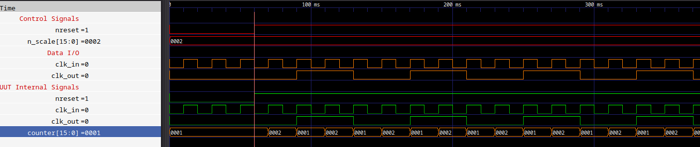
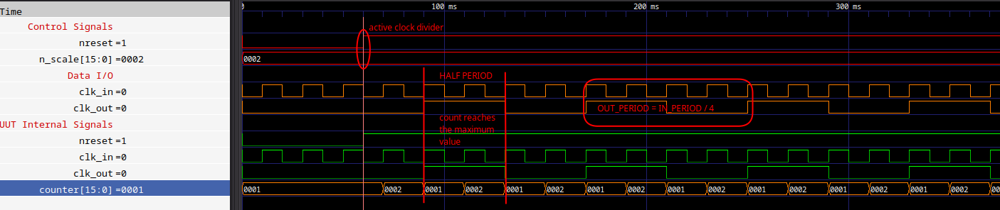
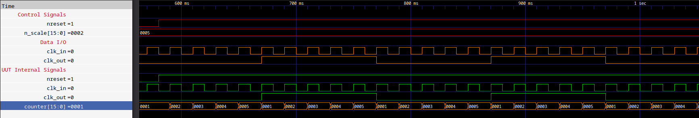

CLK_2N_DIVIDER
===============================================================================
<br/>

Description
-------------------------------------------------------------------------------
<br/>
This IP allows to divide in frequency an input clock and return a clock derived from the one in input according to the formula:<br/>

$$ out\_freq = {input\_freq \over 2 * unsigned(n\_scale)} $$

and n_scale is the division factor.

<br/>

Source
-------------------------------------------------------------------------------
<br/>

### Entity
<br/>

```vhdl
entity clk_2N_divider is
    Port ( 
        nreset  : in  STD_LOGIC;
        clk_in  : in  STD_LOGIC;
        n_scale : in  STD_LOGIC_VECTOR( 15 downto 0 );
        clk_out : out STD_LOGIC
    );
end clk_2N_divider;
```

<br/>

### Parameters
| Signal |   Type    | Description                     |
| -----: | :-------: | :------------------------------ |

<br/>

### Input
|      Signal |       Type       | Description                              |
| ----------: | :--------------: | :--------------------------------------- |
|  **nreset** |    STD_LOGIC     | Asynchronous reset (active low)          |
|  **clk_in** |    STD_LOGIC     | Clock to divede                          |
| **n_scale** | STD_LOGIC_VECTOR | 16bit data used to scale the input clock |

<br/>

### Output
|      Signal |   Type    | Description                                                                |
| ----------: | :-------: | :------------------------------------------------------------------------- |
| **clk_out** | STD_LOGIC | Clock with: $$ frequency = {freq(clk\_in) \over 2 * unsigned(n\_scale)} $$ |


<br/>

Testbench and Simulation
-------------------------------------------------------------------------------
<br/>

### clk_2N_divider_tb.vhd

Simulation in which there we set N = 2 and after N = 5.

<br/>


|  |
|:--:|
| <b>Fig.1 - Clock divider with N = 2</b>|

<br/>


|  |
|:--:|
| <b>Fig.2 - Clock divider with N = 2. Explanation.</b>|

<br/>

|  |
|:--:|
| <b>Fig.3 - Clock divider with N = 5</b>|

<br/>


Note
-------------------------------------------------------------------------------
<br/>
- The output clock is generated starting by the first rising edge of the input clock, after the reset si deasserted.

<br/>

Authors
-------------------------------------------------------------------------------
- [Davide Cardillo](https://github.com/DavBoot01)
