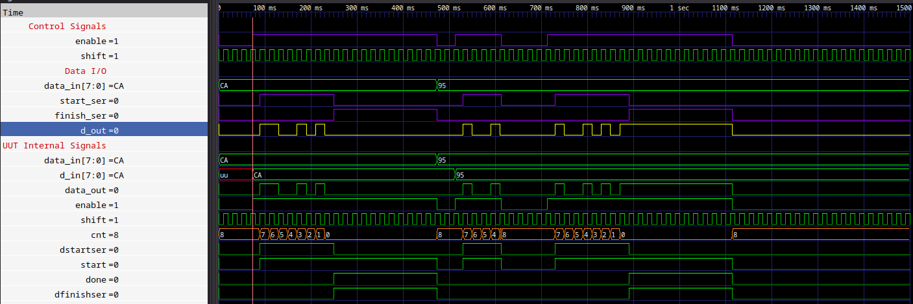
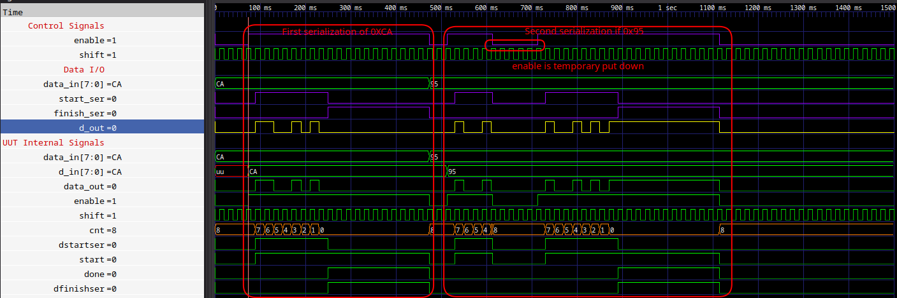
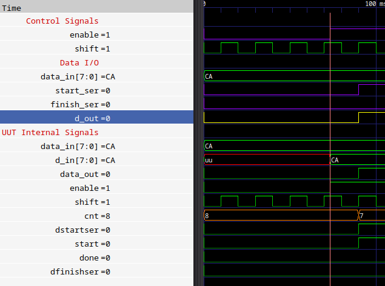
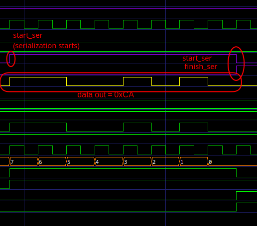

Parallel2Serial
===============================================================================

<br/>

Description
-------------------------------------------------------------------------------
<br/>

This block allows to serialize an array given as input. The size of this input is programmable via entity's parameter (see below). A periodic signal or not can be given in input in order to scan the procedure; in this way each bit of the serialized data can have a wanted period (also indipendent from each other).

<br/>

Source
-------------------------------------------------------------------------------
<br/>

### Entity
<br/>

```vhdl
entity parallel2serial is
    Generic (
        DATA_WIDTH : INTEGER range 1 to (INTEGER'high) := 8
    );
    Port ( 
        enable      : in  STD_LOGIC;                                       -- if active, it disables the acquisition (active low) 
        shift       : in  STD_LOGIC;                                       -- data bit acquire eneable
        data_in     : in  STD_LOGIC_VECTOR( (DATA_WIDTH - 1 ) downto 0 );
        data_out    : out STD_LOGIC;
        dstartser   : out STD_LOGIC;                                       -- active at first recorded bit (data start recording)
        dfinishser  : out STD_LOGIC                                        -- data ready (active high)
    );
end parallel2serial;
```

<br/>

### Parameters
|         Signal |  Type   | Description                   |
| -------------: | :-----: | :---------------------------- |
| **DATA_WIDTH** | INTEGER | Size of the input data array. |

<br/>

### Input
|      Signal |      Type      | Description                                                               |
| ----------: | :------------: | :------------------------------------------------------------------------ |
|  **enable** |   STD_LOGIC    | Start the serialization of the data. Is asynchronous to the shift signal. |
|   **shift** |   STD_LOGIC    | Used to shift to the next bit. Can be period or not.                      |
| **data_in** | STD_LOG_VECTOR | With size of  **DATA_WIDTH**. Data array to serialize.                    |

<br/>

### Output
|         Signal |   Type    | Description                                                            |
| -------------: | :-------: | :--------------------------------------------------------------------- |
|   **data_out** | STD_LOGIC | Serialized data. The duration of each bit depends by **shift** signal. |
|  **dstartser** | STD_LOGIC | Is high during the whole serialization procedure.                      |
| **dfinishser** | STD_LOGIC | Becomes high at the end of the serialization procedure.                |

<br/>

Testbanch and Simulation
-------------------------------------------------------------------------------

<br/>

### parallel2serial_tb.vhd

Test in which we perform two serializations, one with input value set to 0XCA and the second one with 0X95 as input value. So, in this simulation there is **DATA_WIDTH** set @ 8, in order to have byte as input.<br/>
During the second serialization there is a period in which the **enable** signal goes low and then goes back high and continues with the serialization. <br/>
A periodic signal (clock) is used to generate the **shift** input signal. <br/>

<br/>


|  |
|:--:|
| <b>Fig.1 - Complete simulation</b>|

<br/>


|  |
|:--:|
| <b>Fig.2 - Two simulation blocks</b>|

<br/>

|  |
|:--:|
| <b>Fig.3 - Start the serialization with enable high</b>|

<br/>


|  |
|:--:|
| <b>Fig.4 - Serialization procedure</b>|


<br/>

Note
-------------------------------------------------------------------------------

- The **start_ser** and **finish_ser** signals are synchronous with **shift** signal (see **Fig. 3**). **start_ser** goes high with the first rising edge of **shift** after **enable** signal has gone high.
- To perform the whole serialization **DATA_WIDTH + 1** rising edges of **shift** signal are needed.
- The **start_ser** and **finish_ser** signals go low and high, respectively, when the last bit has been serialized and this happens at (**DATA_WIDTH + 1**)-th rising edge of **shift** (see **Fig. 4**).
- **finish_ser** stays high until when **enable**.
- Thre is no a reset signal and a falling edge of **enable** does not reset the state of the serializazion (freezes it only). In fact if there is a high2low and a low2high activity over the **enable** signal during a setialization, it goes to ends anyway (see **Fig. 2**).