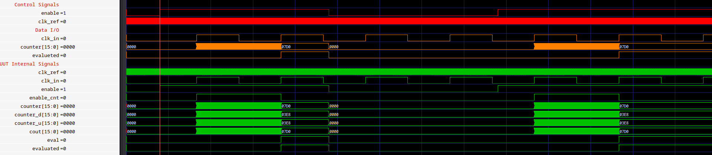
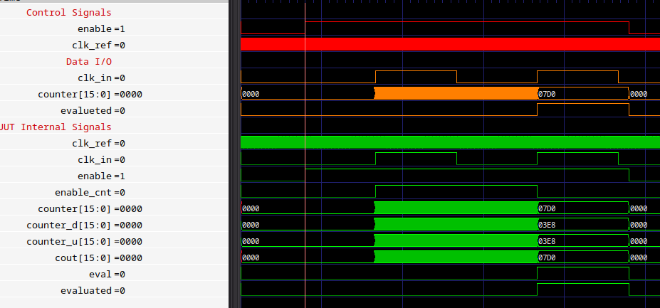
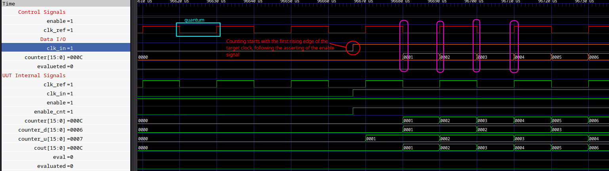

FREQUENCY_COUNTER
===============================================================================

<br/>

Description
-------------------------------------------------------------------------------
<br/>
This IP evaluates the frequency of an input clock. The frequency counting is refered to a reference clock given in input and the available value in output (frequency of input clock) is counted in numeber of edges (both rising and falling) of ref clock into the period of input clock. So the aspected outcome is:

$$ quantum = { 1 \over 2*f\_ref } = { T\_ref \over  2}  $$

$$ n\_edge = { T\_input \over quantum } $$

The output of this IP is **n_edge** expressed as 16 bit data. So the outcome is a digital expression of the frequency of the target clock, refered to ref clock source.

<br/>

> **Note**: **T_ref** is the time period of ref clock.

> **Note**: **T_input** is the time period of input (target) clock.

> **Note**: **n_edge** is the number of edges (both rising and falling) of ref clock during the **evaluation time**.

> **Note**: **evaluation time** is a period of the input clock (so is the time T_input).

To better understand as the IP works, see the testbench below with its images.

<br/>

Source
-------------------------------------------------------------------------------
<br/>

### Entity
<br/>

```vhdl
entity frequency_counter is
    Port ( 
        clk_ref  : in  STD_LOGIC;
        clk_in   : in  STD_LOGIC;
        enable   : in  STD_LOGIC;
        
        cout     : out STD_LOGIC_VECTOR(15 downto 0);
        eval     : out STD_LOGIC
    );
end frequency_counter;
```

<br/>

### Parameters
|  Signal |   Type    | Description                                                             |
| ------: | :-------: | :---------------------------------------------------------------------- |

<br/>

### Input
|  Signal |   Type    | Description                                                             |
| ------: | :-------: | :---------------------------------------------------------------------- |
| clk_ref | STD_LOGIC | Reference clock used as unit time of measure of input clock's frequency |
|  clk_in | STD_LOGIC | Input clock whose frequency you want to measure                         |
|  enable | STD_LOGIC | Active high, enables the counting procedure                             |

<br/>

### Output
| Signal |       Type       | Description                                                                 |
| -----: | :--------------: | :-------------------------------------------------------------------------- |
|   cout | STD_LOGIC_VECTOR | 16bit array used for the evaluated clock frequency                          |
|   eval |    STD_LOIGIC    | Active high, tells when the counting is finished and the value is available |

<br/>

Testbench and Simulation
-------------------------------------------------------------------------------

<br/>

### frequency_counter_tb.vhd

<br/>

The simulation includes two evaluation sessions of the same input clock with the same reference clock. This is made to show how the **enable** signal works and how is the behavior of the IP after a reset. <br/>
The simulation parameters are (see description session for the parameters' naming): <br/>

|   Parameter | Value |
| ----------: | :---: |
|   **T_ref** | 20us  |
| **T_input** | 20ms  |

So the aspected values are:

|   Parameter |    Value     |
| ----------: | :----------: |
| **quantum** |     10us     |
|  **n_edge** | 2000 (0x7D0) |

<br/>

|  |
|:--:|
| <b>Fig.1 - Whole simulation with two evaluation sessions.</b>|

<br/>

|  |
|:--:|
| <b>Fig.2 - Output of the evaluation = 0x7D0 (dec 2000).</b>|

<br/>

|  |
|:--:|
| <b>Fig.3 - Explanation of the counting.</b>|

<br/>

Note
-------------------------------------------------------------------------------


<br/>

Authors
-------------------------------------------------------------------------------
- [Davide Cardillo](https://github.com/DavBoot01)
