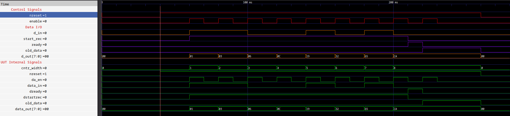
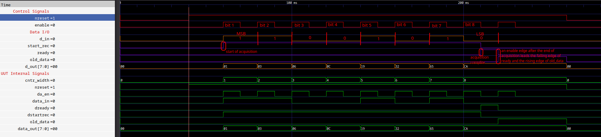

Serial2Parallel
===============================================================================

<br/>

Description
-------------------------------------------------------------------------------
<br/>

This IP allows the parallelization of a single stream line of bit. The size of the output data array is an IP's parameter. There are control signals that tell when the data output is available.

<br/>

Source
-------------------------------------------------------------------------------
<br/>

### Entity
<br/>

```vhdl
entity serial2parallel is
    Generic (
        DATA_WIDTH : INTEGER range 1 to (INTEGER'high)  := 8
    );
    Port ( 
        nreset    : in  STD_LOGIC;                                       -- if active, it disables the acquisition (active low) 
        da_en     : in  STD_LOGIC;                                       -- data bit acquire eneable
        data_in   : in  STD_LOGIC;
        data_out  : out STD_LOGIC_VECTOR( (DATA_WIDTH - 1 ) downto 0 );
        dstartrec : out STD_LOGIC;                                       -- active at first recorded bit (data start recording)
        dready    : out STD_LOGIC;                                       -- data ready (active high)
        old_data  : out STD_LOGIC
        
    );
end serial2parallel;
```

<br/>

### Parameters
|         Signal |  Type   | Description                   |
| -------------: | :-----: | :---------------------------- |
| **DATA_WIDTH** | INTEGER | Size of the input data array. |

<br/>

### Input
|      Signal |   Type    | Description                                                      |
| ----------: | :-------: | :--------------------------------------------------------------- |
|  **nreset** | STD_LOGIC | Asynchronous reset (active low)                                  |
|   **da_en** | STD_LOGIC | Synchronous/Asynchronous data acquisition signal (@ rising edge) |
| **data_in** | STD_LOGIC | Input signal to acquire and insert into output data array        |

<br/>

### Output
|        Signal |       Type       | Description                                                                                    |
| ------------: | :--------------: | :--------------------------------------------------------------------------------------------- |
|  **data_out** | STD_LOGIC_VECTOR | Output data array make up by all acquired bytes (with size of  (**DATA_WIDTH** )               |
| **dstartrec** |    STD_LOGIC     | Active (high) when the first bit has been acquiread and goes low when the last bit is acquired |
|    **dready** |    STD_LOGIC     | Active (high) when last bit is acquired and indicates that output data array is available      |
|  **old_data** |    STD_LOGIC     | Active (high) when the data output is available end other rising edge of **da_en** occurres    |

  
<br/>

Testbanch and Simulation
-------------------------------------------------------------------------------

<br/>

### serial2parallel_tb.vhd

Test in which a single 8bits data is acquiread (in this simulation there is **DATA_WIDTH** set @ 8). <br/>
A period signal is used to drive **da_en** control signal. <br/>
In this test the **data_in** signal is driven in order to have in output the value 0xCA.

<br/>


|  |
|:--:|
| <b>Fig.1 - Complete acquisition</b>|

<br/>


|  |
|:--:|
| <b>Fig.2 - Two simulation blocks</b>|


<br/>

Note
-------------------------------------------------------------------------------

- **nreset** is an asynchronous reset.
- **da_en**, in the simulation, is used as periodic signal but it can be also aperiodic.
- **dready** stays high after the **DATA_WIDTH**-th bit has been acquired and goes down when **nreset** is assered. Another reason of which **dready** falling down is because there is another activity over the **da_en** signal (so after the acquisition is complited). This last causes also the rising of **old_data** signal.
- **old_data** is used to tell that a data is available on output, but there been some activities on **da_en** without any acquisition since there need a reset of the IP in order to start with a new acquisition.

<br/>

Authors
-------------------------------------------------------------------------------
- [Davide Cardillo](https://github.com/DavBoot01)
